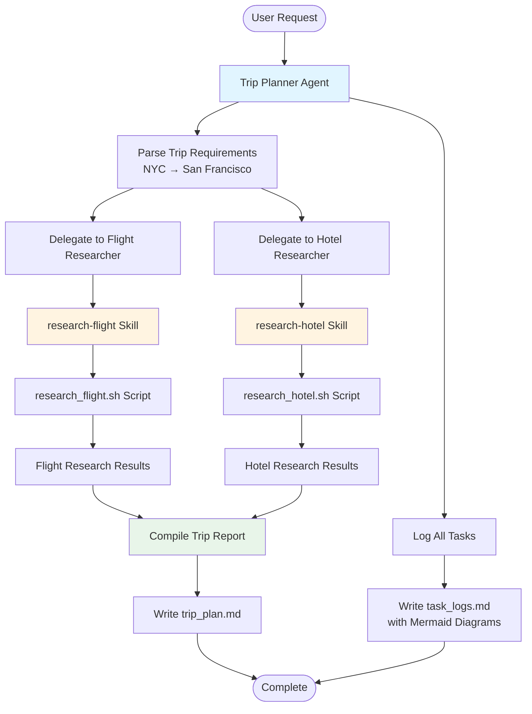

# Plan: NYC to San Francisco Trip Planning

## Overview

Plan a trip from NYC to San Francisco by coordinating research through the trip-planner agent system, which delegates to flight-researcher and hotel-researcher agents. Document the process comprehensively with a trip report and detailed task logs including Mermaid diagrams.

## Architecture Flow

The trip planning follows this orchestration pattern:

## Implementation Steps

### Phase 1: Initialize and Parse Requirements

**Files**: `reports/plan_to_san_francisco/task_logs.md`, `reports/plan_to_san_francisco/trip_plan.md`

**Acceptance Criteria**:

- Task logs file initialized with header and initial Mermaid diagram
- Trip requirements parsed: origin (NYC), destination (San Francisco)
- Initial task log entry created

**Test Plan**:

- Verify task_logs.md contains initial structure
- Verify trip requirements are correctly identified

**MVP Slice**: Create initial structure in both files with headers

### Phase 2: Delegate Flight Research

**Files**: `reports/plan_to_san_francisco/task_logs.md`

**Acceptance Criteria**:

- Task delegated to flight-researcher agent
- research-flight skill executed via research_flight.sh
- Flight results captured and logged
- Mermaid diagram updated showing flight research flow

**Test Plan**:

- Verify flight research task appears in logs
- Verify flight results are captured
- Verify diagram includes flight research node

**MVP Slice**: Execute flight research and log the delegation and results

### Phase 3: Delegate Hotel Research

**Files**: `reports/plan_to_san_francisco/task_logs.md`

**Acceptance Criteria**:

- Task delegated to hotel-researcher agent
- research-hotel skill executed via research_hotel.sh
- Hotel results captured and logged
- Mermaid diagram updated showing hotel research flow

**Test Plan**:

- Verify hotel research task appears in logs
- Verify hotel results are captured
- Verify diagram includes hotel research node

**MVP Slice**: Execute hotel research and log the delegation and results

### Phase 4: Compile Trip Report

**Files**: `reports/plan_to_san_francisco/trip_plan.md`

**Acceptance Criteria**:

- Trip report includes:
  - Trip summary (NYC → San Francisco)
  - Flight recommendations/results
  - Hotel recommendations/results
  - Travel dates (if applicable)
  - Any additional trip planning notes
- Report is well-formatted and comprehensive

**Test Plan**:

- Verify trip_plan.md contains all required sections
- Verify flight and hotel information is present
- Verify formatting is clear and readable

**MVP Slice**: Create structured trip report with flight and hotel sections

### Phase 5: Complete Task Logs with Diagrams

**Files**: `reports/plan_to_san_francisco/task_logs.md`

**Acceptance Criteria**:

- Complete task log includes:
  - Chronological log of all actions taken
  - Detailed descriptions of how each task was addressed
  - Final Mermaid diagram showing complete workflow
  - Timestamps or sequence numbers for each action
- Diagram accurately represents the multi-agent orchestration

**Test Plan**:

- Verify all tasks are logged with details
- Verify Mermaid diagram renders correctly
- Verify diagram shows complete flow from start to finish

**MVP Slice**: Complete task logs with comprehensive Mermaid workflow diagram

## Task Execution Strategy

1. **Use trip-planner subagent**: Delegate the main trip planning coordination to the trip-planner subagent
2. **Sequential delegation**: First research flights, then hotels (can be parallel in future iterations)
3. **Logging approach**: Log each step immediately after execution with timestamps
4. **Diagram updates**: Update Mermaid diagram incrementally as tasks complete

## Key Files to Modify

- `reports/plan_to_san_francisco/trip_plan.md` - Main trip report output
- `reports/plan_to_san_francisco/task_logs.md` - Comprehensive task logs with Mermaid diagrams

## Expected Outputs

### trip_plan.md Structure:

- Trip Overview (NYC → San Francisco)
- Flight Information
- Hotel Information
- Additional Recommendations

### task_logs.md Structure:

- Header with trip planning context
- Chronological task log entries
- Mermaid diagram showing agent orchestration
- Detailed explanations of each step
