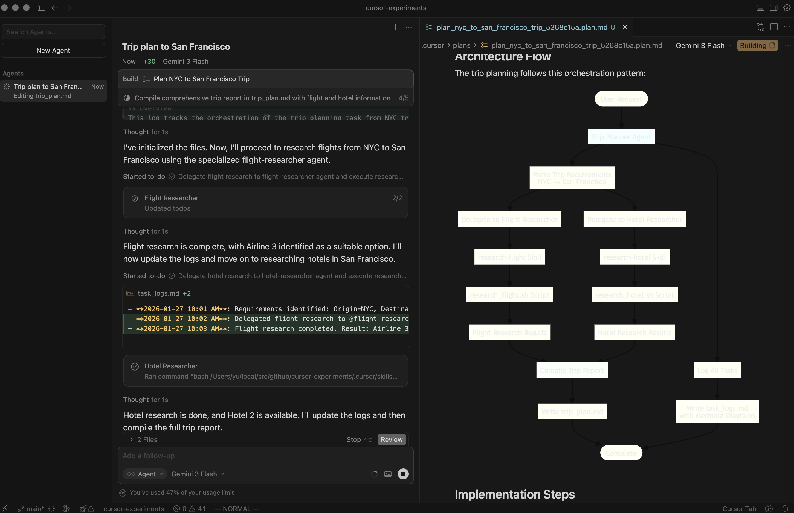
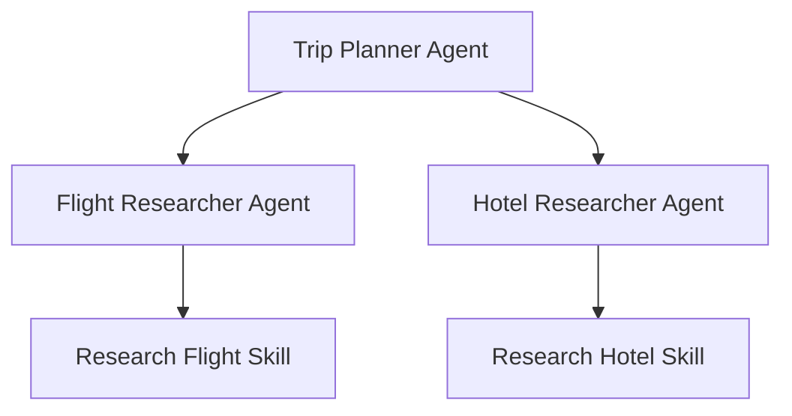

# Demo: Multi-Agent Orchestration in Cursor

This project demonstrates how specialized AI agents can collaborate to solve complex, multi-step tasks within the Cursor IDE.

## Project Goal

The primary goal is to showcase the **orchestration capability** of Cursor's agentic framework. By defining a high-level "Trip Planner" agent that coordinates with specialized "Flight" and "Hotel" researchers, we illustrate a modular and scalable approach to automated problem-solving.



## Key Features

- **Multi-Agent Collaboration**: Transparent delegation of sub-tasks from a primary agent to specialized sub-agents.
- **Skill-Based Execution**: Integration of custom "Agent Skills" that execute shell scripts to perform specific actions (e.g., searching data).

## Subagents and Agent Skills

### Agents

- [@trip-planner](.cursor/agents/trip-planner.md): Orchestrates the entire trip planning process by delegating tasks to specialized agents.
- [@flight-researcher](.cursor/agents/flight-researcher.md): Researches flight options based on origin and destination.
- [@hotel-researcher](.cursor/agents/hotel-researcher.md): Researches hotel accommodations at the destination.

### Agent Skills

- [@research-flight](.cursor/skills/research-flight/SKILL.md): Executes flight search scripts to retrieve travel options.
- [@research-hotel](.cursor/skills/research-hotel/SKILL.md): Executes hotel search scripts to retrieve accommodation details.

### Relationships across subagents and Agent Skills



## Usage Instructions

To run the demonstration:

1. Open the Cursor IDE in this repository.
2. Open the Chat panel (`Cmd+L` or `Ctrl+L`).
3. Use the `@trip-planner` agent by typing its name or using the `/trip-planner` slash command (if configured).
4. Provide a prompt such as:

   ```text
   I want to go to San Francisco from NYC. Please write a trip report in @reports/plan_to_san_francisco/trip_plan.md and logs in @reports/plan_to_san_francisco/task_logs.md.
   ```

5. Observe how Cursor orchestrates the sub-agents and generates the requested files.

## Directory Structure

- **`.cursor/agents/`**: Contains agent definitions (YAML-frontmatter Markdown) defining their roles and capabilities.
- **`.cursor/skills/`**: Defines custom skills that agents can use, including the scripts they execute.
- **`reports/`**: The output directory for generated trip plans and task logs.
- **`docs/`**: Project documentation and assets, including screenshots.

## Technical Implementation

The orchestration follows a hierarchical pattern:

1. **Agent Definition**: Each agent is defined in `.cursor/agents/`. For example, `trip-planner.md` defines its ability to collaborate with `flight-researcher` and `hotel-researcher`.
2. **Skill Integration**: Agents use skills defined in `.cursor/skills/`. Each skill maps to a specific action, such as executing a shell script.
3. **Simulation Scripts**: For this demo, flight and hotel searches are simulated using Bash scripts (`research_flight.sh` and `research_hotel.sh`) that return randomized results to illustrate the data flow.
4. **Mermaid Generation**: The `trip-planner` is instructed to generate a Mermaid diagram in the task logs to visualize the actual execution path taken during the task.

## Example

### Prompt to Cursor IDE

I submit the following prompt to Cursor IDE:

```text
/trip-planner I want to go to San Francisco from NYC.

Please write a trip report in @reports/plan_to_san_francisco/trip_plan.md .

You have to comprehensively and precisely leave logs what and how you address the tasks with a diagram in Mermaid in @reports/plan_to_san_francisco/task_logs.md .

You have to show a diagram of what you address the task in the plan.
```

### Result

- [Cursor plan](.cursor/plans/plan_nyc_to_san_francisco_trip_5268c15a.plan.md)
- [Trip report](reports/plan_to_san_francisco/trip_plan.md)
- [Task logs](reports/plan_to_san_francisco/task_logs.md)
