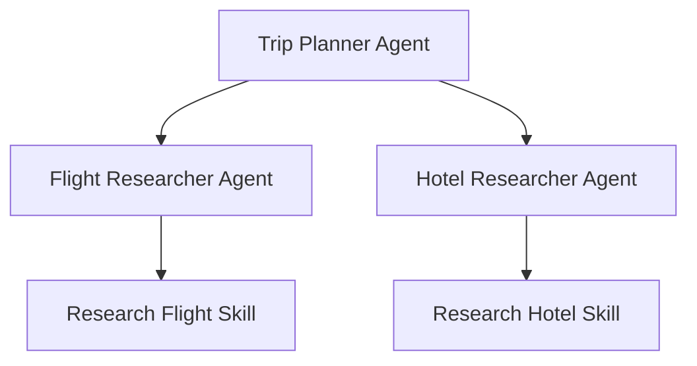

# Showcase: Multi-Agent Orchestration in Cursor - Coordinating Specialized Agents

Hi everyone! I wanted to share a demonstration of how we can use Cursor's agentic framework to orchestrate multiple specialized agents to solve complex, multi-step tasks.

## The Concept: Orchestration Over Monoliths

Instead of having one giant agent try to do everything, we can break down complex problems into specialized roles. In this demo, we use a hierarchical structure:

1. **Primary Agent (`@trip-planner`)**: Acts as the coordinator. It understands the high-level goal and delegates specific research tasks.
2. **Specialized Sub-Agents (`@flight-researcher`, `@hotel-researcher`)**: Experts in their respective domains. They don't need to know about the overall plan, just how to execute their specific task.

## How it Works

The project is structured using the standard Cursor configuration folders:

- **`.cursor/agents/`**: Defines the persona, instructions, and collaboration rules for each agent.
- **`.cursor/skills/`**: Houses custom capabilities (Agent Skills) that agents can invoke. These skills can execute shell scripts to perform real-world actions like searching an API or processing data.

### The Execution Flow

When you ask the `@trip-planner` to plan a trip from NYC to San Francisco, it doesn't just "guess." It systematically delegates:

## Real-World Application

In this demo:
- The **Flight Researcher** uses a script to retrieve airline options.
- The **Hotel Researcher** uses a script to find accommodations.
- The **Trip Planner** compiles these into a structured `trip_plan.md` and generates a detailed `task_logs.md` with a Mermaid orchestration diagram to show exactly how the work was distributed.

## Key Takeaways for Cursor Users

- **Modularity**: Specialized agents are easier to maintain and refine.
- **Delegation**: High-level agents can focus on logic and coordination, while sub-agents handle the "grunt work."
- **Skill Integration**: Connecting agents to shell scripts opens up endless possibilities for automation beyond simple text generation.

---

I'd love to hear how others are using multi-agent workflows in Cursor! Are you using delegation for your development tasks? What kind of custom skills have you built?

Check out the full demo in this repo to see the configuration files and execution logs!
