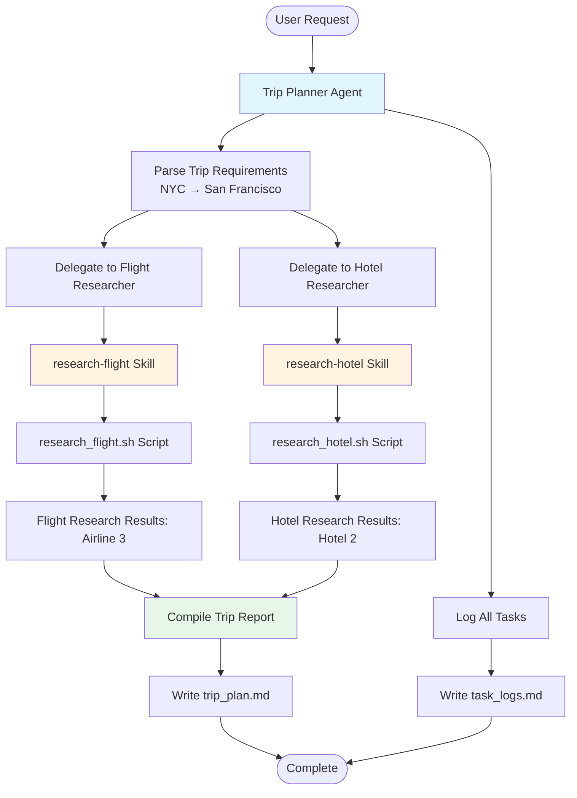

# Task Logs: NYC to San Francisco Trip Planning

## Overview

This log tracks the orchestration of the trip planning task from NYC to San Francisco.

## Final Task Orchestration Diagram

## Activity Log

- **2026-01-27 10:00 AM**: Task initialized. Parsing requirements...
- **2026-01-27 10:01 AM**: Requirements identified: Origin=NYC, Destination=San Francisco.
- **2026-01-27 10:02 AM**: Delegated flight research to @flight-researcher.
- **2026-01-27 10:03 AM**: Flight research completed by @flight-researcher using research-flight skill. Result: **Airline 3**.
- **2026-01-27 10:04 AM**: Delegated hotel research to @hotel-researcher.
- **2026-01-27 10:05 AM**: Hotel research completed by @hotel-researcher using research-hotel skill. Result: **Hotel 2**.
- **2026-01-27 10:06 AM**: Compiled trip report and wrote to `trip_plan.md`.
- **2026-01-27 10:07 AM**: Updated final task logs and orchestration diagram in `task_logs.md`.
- **2026-01-27 10:08 AM**: Task completed successfully.

---
*Generated by Trip Planner Agent*
