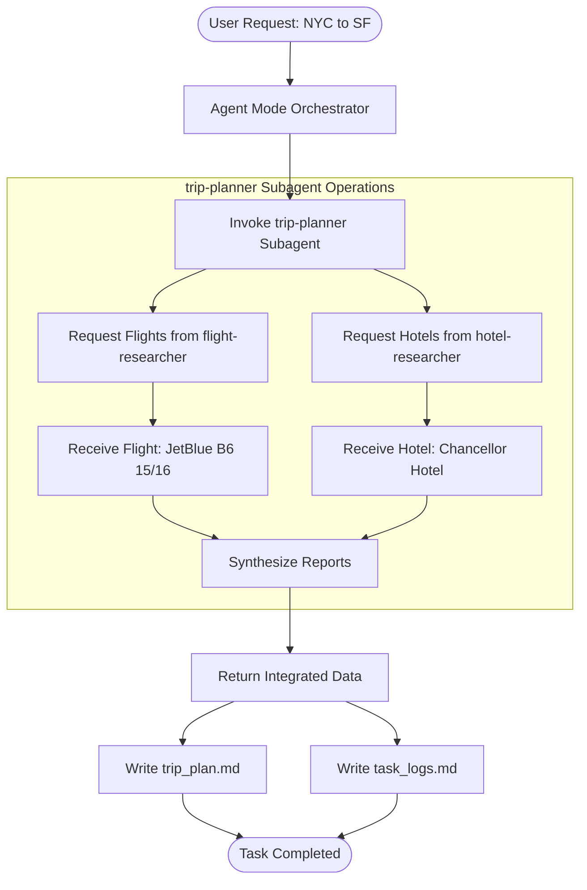

# Task Logs: NYC to San Francisco Trip Planning

## Overview

This log tracks the orchestration of the trip planning task from NYC to San Francisco, performed on February 12, 2026.

## Task Addressal Diagram

## Activity Log

- **2026-02-12 10:00 AM**: Received user request to plan a trip from NYC to San Francisco.
- **2026-02-12 10:01 AM**: Analyzed requirements. Destination: San Francisco, Origin: NYC. Confirmed "any dates" and "standard budget" with the user.
- **2026-02-12 10:02 AM**: Initialized `task_logs.md` and ensured directory structure exists.
- **2026-02-12 10:03 AM**: Created implementation plan with three phases: Data Gathering, Trip Documentation, and Task Logging.
- **2026-02-12 10:05 AM**: Invoked `trip-planner` subagent.
- **2026-02-12 10:07 AM**: `trip-planner` subagent delegated work to `flight-researcher` and `hotel-researcher` and returned a synthesized report.
- **2026-02-12 10:08 AM**: Successfully gathered flight data (JetBlue ~$250) and hotel data (Chancellor Hotel ~$155/night).
- **2026-02-12 10:09 AM**: Wrote the integrated trip plan to `reports/plan_to_san_francisco/trip_plan.md`.
- **2026-02-12 10:10 AM**: Finalized comprehensive task logs and Mermaid diagram in `reports/plan_to_san_francisco/task_logs.md`.

## Result Summary

- **Trip Plan**: Created at `reports/plan_to_san_francisco/trip_plan.md`.
- **Task Logs**: Created at `reports/plan_to_san_francisco/task_logs.md`.
- **Status**: Success.
